# rqt2-widgets

<picture>
  <source media="(prefers-color-scheme: dark)" srcset="https://github.com/RQT2/rqt2-components/blob/main/assets/branding/logo-main-light.svg">
  <source media="(prefers-color-scheme: light)" srcset="https://github.com/RQT2/rqt2-components/blob/main/assets/branding/logo-main-dark.svg">
  
</picture>

[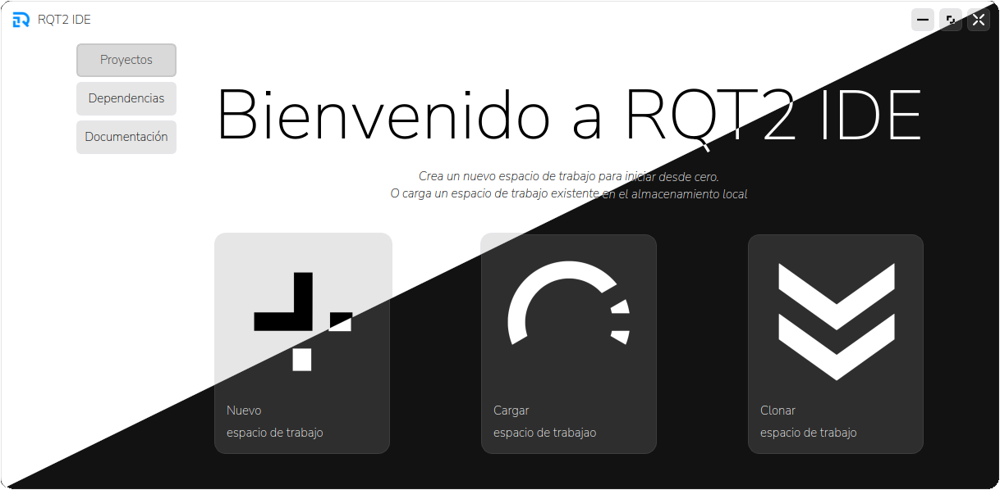](#)

Formularios y componentes reutilizables para RQT2 usando `XML UI` y `PySide6`. Este repositorio proporciona una colección de widgets y formularios. El reposicorio está diseñado para incorporar las paletas de colores y estilos `QSS` definidos en [rqt2-components](https://github.com/RQT2/rqt2-components).

## Quickstart

Para usar los widgets en tu proyecto, puedes clonar este repositorio o añadirlo como submódulo.

### Añadir a un módulo nuevo

```bash
# Usa la carpeta external/ para recursos compartidos
git submodule add https://github.com/RQT2/rqt2-widgets.git external/rqt2-widgets
git submodule update --init --recursive

```

### Sincronizar cambios

```bash
git submodule update --remote --merge
```

## Estructura del Repositorio

```text
./
├── forms/               # Ventanas de la aplicación
├── utils/               # Funciones de utilidad relacionadas con las ventanas
```

## Ventanas Disponibles

### `f0_main.ui`

[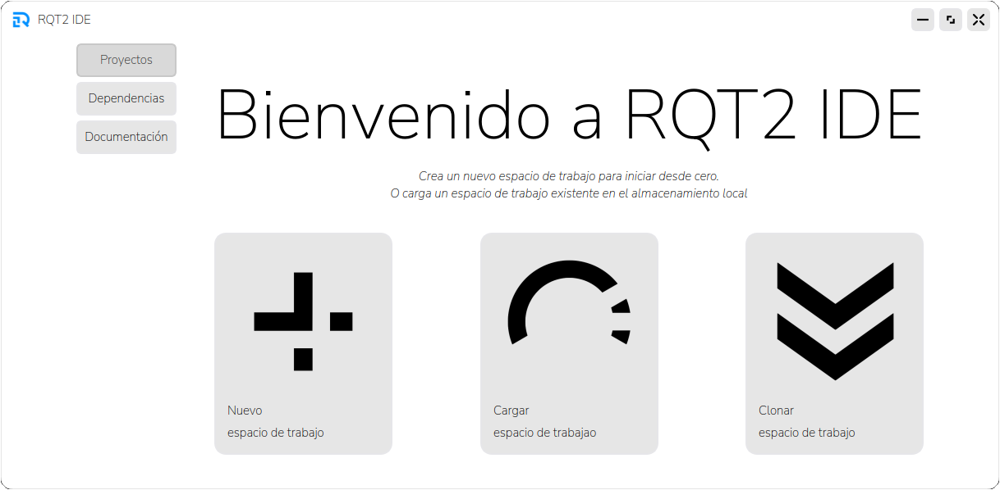](#)[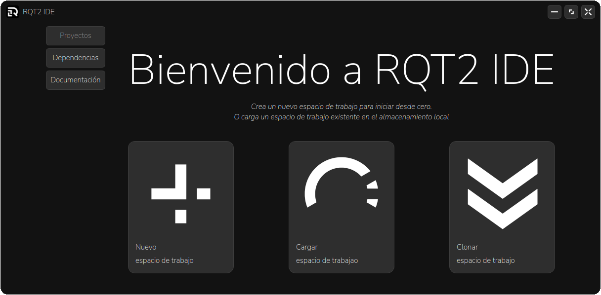](#)

Ventana inicial con opciones para acceder a las ventanas para crear, abrir y clonar espacios de trabajo, así como al gestor de paquetes. Esta ventana sirve como punto de partida para navegar por las diferentes funcionalidades de la aplicación.

### `f1_new_ws.ui`

[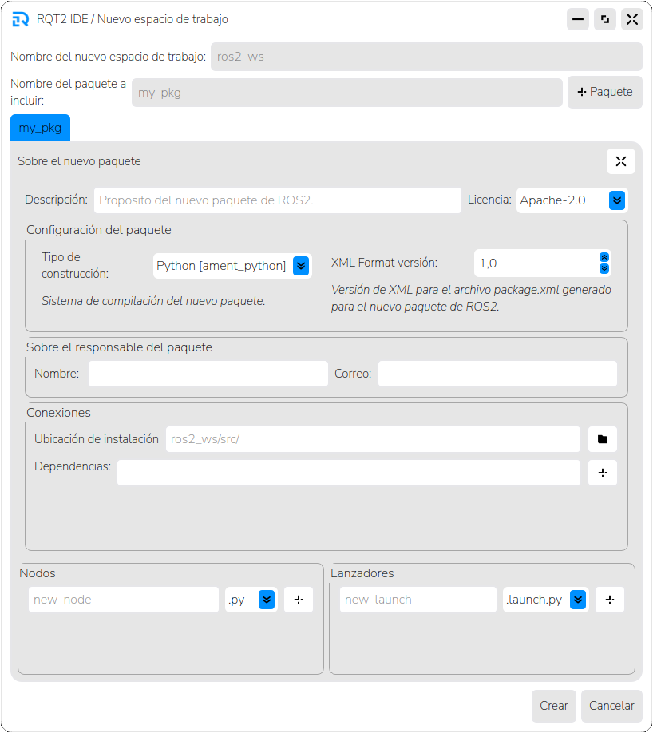](#)[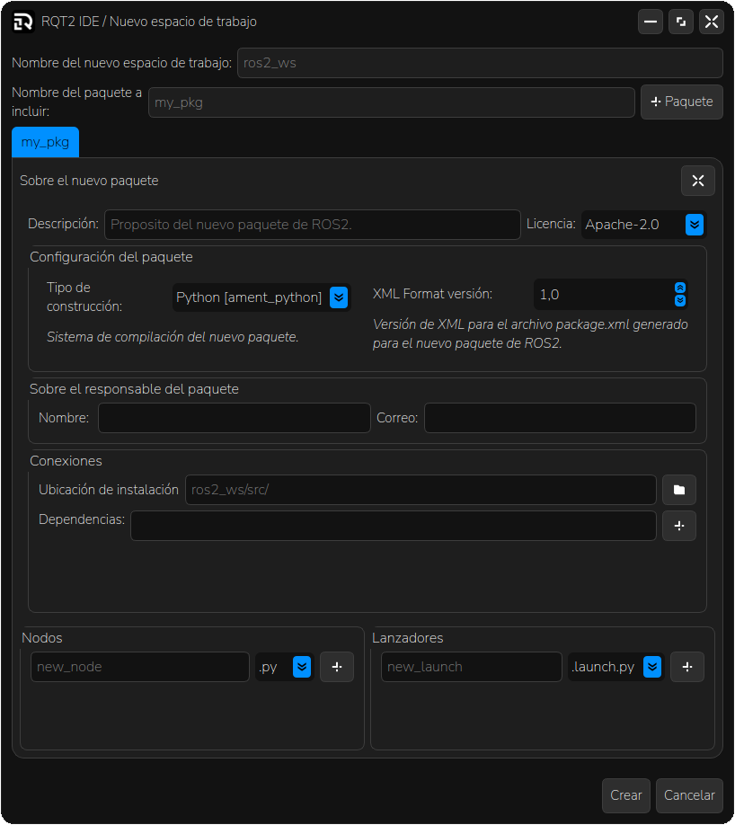](#)

Ventana para crear un nuevo espacio de trabajo. Permite al usuario configurar las opciones necesarias para iniciar un nuevo proyecto, como el nombre del espacio de trabajo, la ubicación y las dependencias iniciales.

### `f3_clone_ws.ui`

[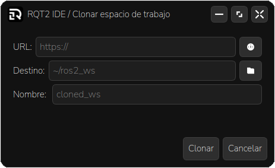](#)[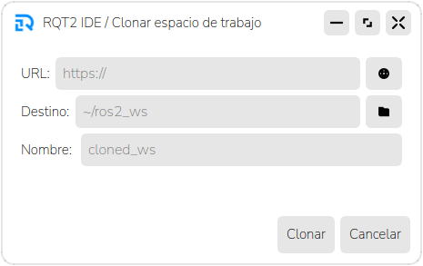](#)

Ventana para clonar un espacio de trabajo existente. Permite al usuario definir la URL del repositorio a clonar, la ubicación donde se guardará el espacio de trabajo clonado y el nombre del nuevo espacio de trabajo.

### `f4_package_manager.ui`

[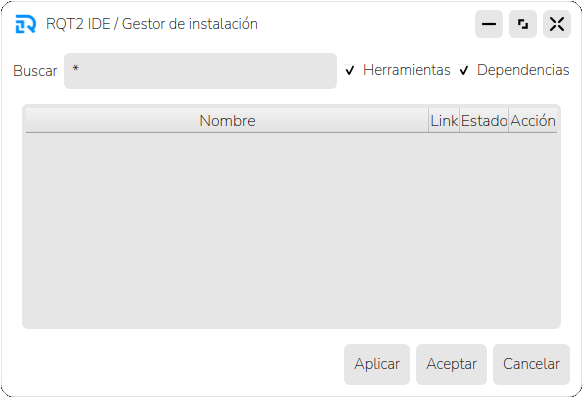](#)[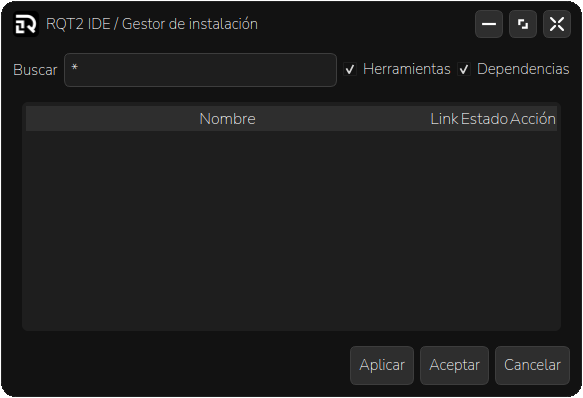](#)

Ventana para gestionar paquetes de Linux relacionados con el desarrollo de ROS2. Proporciona una interfaz para instalar y eliminar paquetes necesarios para el desarrollo de proyectos en ROS2.

### `form.ui`

[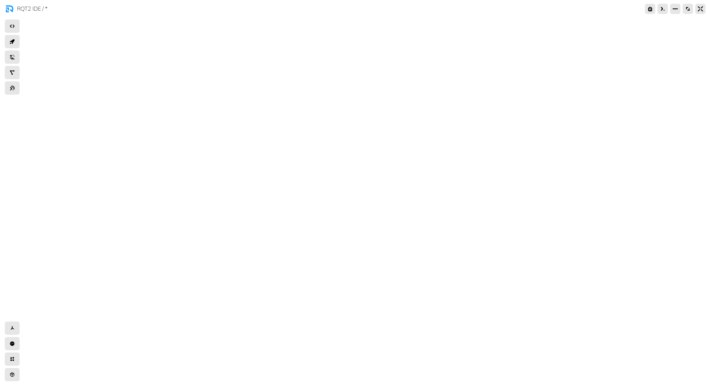](#)[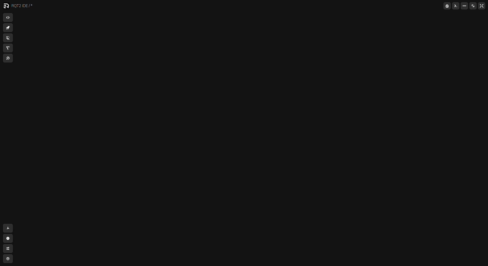](#)

Ventana esqueleto para crear nuevas ventanas. Esta plantilla puede ser utilizada como base para desarrollar nuevas interfaces de usuario como:

- Editores de código
- Formularios de configuración
- Ventanas de interacción con nodos y tópicos de ROS2
- Realizar tareas específicas relacionadas con el desarrollo de proyectos en ROS2, como el uso de `teleop-twist` o conexiones con dispositivos por `SSH`.


## Cómo contribuir

- Lee [CONTRIBUTING.md](CONTRIBUTING.md) antes de enviar PR.
- Para añadir una nueva ventana, crea un nuevo archivo XML en la carpeta `forms/` con `fn_` seguido del nombre descriptivo de la función que cumple.
- En caso de tener componentes reutilizables, añádelos a la carpeta `utils/`

## License

Este proyecto está bajo la licencia **MIT**. Consulta el archivo [LICENSE](LICENSE) para más detalles.

## Maintainers

* **adnKSharp** <adnksharp@gmail.com>